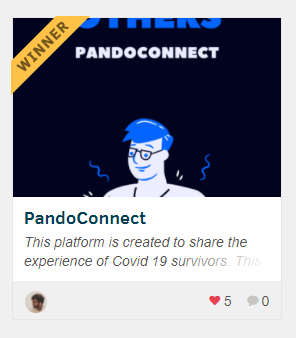

<p align="center">
  
</p>

<p align="center">
  
</p>

<h1 align="center">PandoConnect</h1>

<p align="center">
  <em>Turning recovery stories into positivity — a place for COVID-19 patients and survivors to connect, share, and heal together.</em>
</p>

<p align="center">
  <a href="http://hits.dwyl.com/Souravdey777/PandoConnect"></a>
  <a href="https://opensource.org/licenses/MIT"></a>
  <a href="https://github.com/Souravdey777/PandoConnect/issues"></a>
</p>

---

## 🏆 DEVPOST Hackathon Winner

PandoConnect was recognized as a hackathon winner on DEVPOST. Check out the submission below.

[](https://devpost.com/software/pandoconnect)

## 🌐 Live Demo

**[▶ Launch PandoConnect](http://pandoconnect-c9991.web.app/)**

## 📖 About

The world faced an invisible enemy — one that could not be beaten with weapons, but only by staying apart and supporting one another. At the height of the pandemic, millions of active cases meant tens of millions of people living through fear and mental stress every day.

**PandoConnect is a platform for sharing the experiences of COVID-19 survivors.** When most of what we read about the virus is distressing, this space is built to lift people up instead. Anyone who is a COVID-19 patient, has recovered, or is connected to someone affected can post their story, positive thoughts, and lessons learned. People who simply want to read can browse these stories and take away hope, awareness, and practical hints on staying safe.

The goal is simple: instead of doom-scrolling through grim numbers, come here to see how people around the globe have fought back and recovered — and let that positivity spread.

> **Sentiment scoring:** Every post is given a sentiment score by a real-time machine learning model, so readers can see the emotions behind each story and how strongly they come through.

## ✨ Features

- **Sentiment analysis** — every post is scored so readers can gauge the emotions behind each story.
- **Global connection** — brings people together worldwide around one cause: fighting COVID-19.
- **Share motivating stories** — a feed for recovery experiences and positive thoughts.
- **Realtime data** — posts and interactions update live via Cloud Firestore.
- **Image uploads** — powered by Google Cloud Storage.
- **Authentication** — sign in with Google, plus email/password support.
- **Responsive design** — looks great across screen sizes.
- **Progressive Web App (PWA)** — installable and offline-capable.
- **Hybrid mobile ready** — built on Ionic + Capacitor for native builds.

## 🛠 Tech Stack

| Layer | Technology |
| --- | --- |
| UI Framework | [Ionic React](https://ionicframework.com/docs/react) 5 |
| Library | [React](https://reactjs.org/) 16 |
| Language | [TypeScript](https://www.typescriptlang.org/) |
| Realtime Database | [Cloud Firestore](https://firebase.google.com/docs/firestore) |
| File Storage | [Firebase / Google Cloud Storage](https://firebase.google.com/docs/storage) |
| Authentication | [Firebase Auth](https://firebase.google.com/docs/auth) (Google + Email/Password) |
| Native Runtime | [Capacitor](https://capacitorjs.com/) |
| Delivery | Progressive Web App (PWA) + Firebase Hosting |
| Tooling | Create React App (react-scripts), Ionicons, date-fns |

## 🚀 Getting Started

### Prerequisites

- [Node.js](https://nodejs.org/) (LTS recommended) and npm
- A [Firebase](https://firebase.google.com/) project with **Firestore**, **Storage**, and **Authentication** enabled

### Installation

```bash
# 1. Clone the repository
git clone https://github.com/Souravdey777/PandoConnect.git
cd PandoConnect

# 2. Install dependencies
npm install

# 3. Configure Firebase (see below)

# 4. Start the development server
npm start
```

The app runs at [http://localhost:3000](http://localhost:3000) by default.

### Firebase configuration

The app reads its Firebase credentials from `src/firebase/config.js`. Replace the values with your own project's config from the Firebase console:

```js
var firebaseConfig = {
  apiKey: "YOUR_API_KEY",
  authDomain: "YOUR_PROJECT.firebaseapp.com",
  databaseURL: "https://YOUR_PROJECT.firebaseio.com",
  projectId: "YOUR_PROJECT",
  storageBucket: "YOUR_PROJECT.appspot.com",
  messagingSenderId: "YOUR_SENDER_ID",
  appId: "YOUR_APP_ID",
  measurementId: "YOUR_MEASUREMENT_ID",
};

export default firebaseConfig;
```

### Available scripts

| Command | Description |
| --- | --- |
| `npm start` | Run the app in development mode with hot reload. |
| `npm run build` | Create an optimized production build in `build/`. |
| `npm test` | Run the test runner in watch mode. |

### Building for mobile (optional)

Because the app is built with Ionic and Capacitor, you can package it as a native iOS/Android app:

```bash
npm run build
npx cap add ios      # or: npx cap add android
npx cap copy
npx cap open ios     # or: android
```

## 📂 Project Structure

```
PandoConnect/
├── public/                 # Static assets, PWA manifest, app icons
├── src/
│   ├── components/         # Reusable UI components (Header, Link, ...)
│   ├── contexts/           # React contexts (UserContext)
│   ├── firebase/           # Firebase setup, config, and auth/db/storage helpers
│   ├── hooks/              # Custom hooks (useAuth, useForm, ...)
│   ├── pages/              # App pages
│   │   ├── auth/           # Login, Signup, Forgot password, Edit profile
│   │   └── tabs/           # Feeds, Trending, Search, Submit, Profile
│   ├── helpers/            # Utility helpers (domain, toast)
│   ├── validators/         # Form validation logic
│   ├── theme/              # Ionic theming variables
│   └── App.js              # App shell and routing
├── capacitor.config.json   # Capacitor (native) configuration
└── firebase.json           # Firebase hosting configuration
```

## 🗺 Roadmap

- [ ] Add sentiment analysis using machine learning models to score every blog post.
- [ ] Login with email and password in addition to Google login.
- [ ] Enhance user interaction and engagement.
- [ ] Ship the mobile application using the hybrid Ionic + Capacitor framework.

## 🤝 Contributing

Contributions are welcome! If you'd like to improve PandoConnect:

1. Fork the repository.
2. Create a feature branch (`git checkout -b feature/amazing-feature`).
3. Commit your changes (`git commit -m 'Add some amazing feature'`).
4. Push to the branch (`git push origin feature/amazing-feature`).
5. Open a Pull Request.

Feel free to open an [issue](https://github.com/Souravdey777/PandoConnect/issues) for bugs, ideas, or questions.

## 📄 License

This project is licensed under the [MIT License](https://opensource.org/licenses/MIT).
